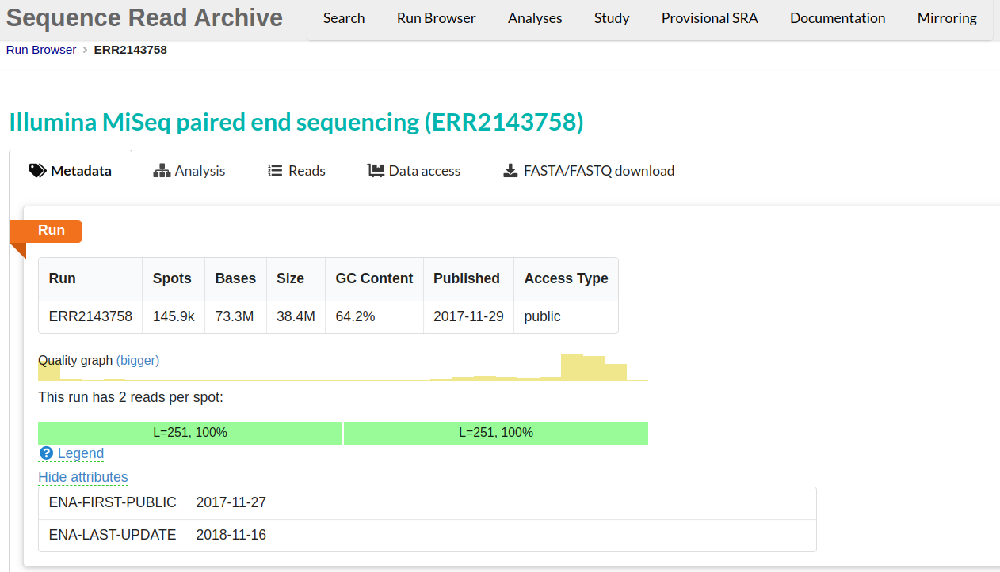

## Public data

In our experiments, we usually think about generating our sequencing data. However, almost all analyses use reference data, and you may want to use it to compare your results or annotate your data with publicly available data. You may also want to do a full project or set of analyses using publicly available data. This data is a great and essential resource for genomic data analysis.

When you come to publish a paper including your sequencing data, most journals and funders require that you place your data in a public repository. It helps to prepare for this early! Sharing your data makes it more likely that your work will be re-used and cited.

There are many repositories for public data. Some model organisms or fields have specific databases, and there are ones for particular data types. Two of the most comprehensive public repositories are provided by the [National Center for Biotechnology Information  (NCBI)](https://www.ncbi.nlm.nih.gov) and the [European Nucleotide Archive (EMBL-EBI)](https://www.ebi.ac.uk/). The NCBI's [Sequence Read Archive (SRA)](https://trace.ncbi.nlm.nih.gov/Traces/sra/) is the database we will be using for this lesson, but the EMBL-EBI's Nucleic Acid Archive (ENA) is also useful. The general processes are similar for any database.

## Accessing the original archived data

The [sequencing dataset (from Okie *et al.* 2020) adapted for this workshop](https://doi.org/10.5281/zenodo.4285900) was obtained from the [NCBI Sequence Read Archive](http://www.ncbi.nlm.nih.gov/sra), which is a large (~27 petabasepairs/2.7 x 10^16 basepairs as of April 2019) repository for next-generation sequence data. Like many NCBI databases, it is complex, and mastering its use is greater than the scope of this lesson. The papers will often have a direct link (perhaps in the supplemental information) to where the SRA dataset can be found. We are only using a small part of the Okie *et al.* 2020 dataset, so a direct link cannot be found. 

## Using the SRA Run Selector

See the figures below to determine how data accession is provided within the original paper. 

The next image shows the study's title, "_Genomic adaptations in information processing underpin trophic strategy in a whole-ecosystem nutrient enrichment experiment_", as well as the authors.

The image below shows an excerpt from the paper that includes information on locating the sequence data. In this case, this text occurs just before the reference section. In the section data availability, the image says that data and metadata have been submitted to the Sequence Reading Archive (SRA) in NCBI and are accessible through the BioProject PRJEB22811. Notice that metadata registers that year was 2017, the place was Cuatro Cienegas Lagunita, the experiment was a fertilization one, and the author is The Craig Venter´s institute.

Follow the next steps to access the data in the SRA using the information in this section. 

1. The paper references "PRJEB22811" as a "BioProject" at NCBI. Go to the [NCBI website](https://www.ncbi.nlm.nih.gov/) and search for "PRJEB22811".

2. You will be shown a link to the "Cuatro Cienegas Lagunita Fertilization Experiment" BioProject. Click on it. 

3. Once on the BioProject page, scroll down to the table under **Project Data**. 

4. This table says there are 40 links to the SRA Experiments of this project. Click on the number 40.

5. Now, you are on the NCBI-SRA site with the 40 samples of this project. This site its NCBI’s new cloud-based SRA interface. At the top of the page is a **Send to** dropdown menu; click on it, select **Run Selector** and click **Go**. This click will take you to [this page](https://www.ncbi.nlm.nih.gov/Traces/study/?query_key=3&WebEnv=MCID_63862368904478135adcaff4&o=acc_s%3Aa) in the SRA Run Selector. You will be presented with a page for the overall BioProject accession PRJEB22811 - this is a collection of all the experimental data.

6. Notice on this page, there are three sections. “Common Fields”, “Select”, and “Found 40 Items”. The sections "Select" and "Found 40 items" are shown in the next image. Select contains information about the run size and the data and metadata table. The "Found 40 items section" is a table where each row contains  id numbers, an alias name, size and links to data for one sample. Within “Found 40 Items”, click on the first Run number (Column “Run”, Row “1”). 

7. This will take you to a page that is a **Run Browser**. Take a few minutes to examine some of the descriptions on the page. In the image we see the  SRA entry **ERR2143758**.  This metadata tab displays run's quality and GC content among other information.

8. Use the browser’s back button to go back to the 'previous page'. As shown in the figure below, the second section of the page (“Select”) has the **Total** row showing you the current number of “Runs”, “Bytes”, and “Bases” in the dataset to date. On 2012-06-27, there were 40 runs, 9.86 GBytes of data, and 19.61 Gbases. 

8. Click on the “Metadata” button to download the file “SraRunTable.txt” and save it on your computer.

9. Review the SraRunTable in a spreadsheet program. Using your favorite spreadsheet program, open the `SraRunTable.txt` file. If prompted by the spreadsheet software, be aware that the SRA Run Selector provides a **comma-separated** file.

> ## Delimiters
> The fields in a table are separated (or delimited) usually by commas or tabs, 
> so they are named with the `.csv` (comma-separated values) and 
> `.tsv`(tab-separated values) extensions, respectively. But since they are both 
> plain text files, you can find them with the `.txt` extension, just like in 
> our `SraRunTable.txt`.
{: .callout}

> ## Discussion 1  
> Discuss with the person next to you:
>
> 1. What was the sequencing platform used for this experiment?
> 2. What samples in the experiment contain
> [paired end](http://www.illumina.com/technology/next-generation-sequencing/paired-end-sequencing_assay.html)
> sequencing data?
> 3. What other kind of metadata is available?
>
> > ## Solution
> > 1. The Illumina sequencing platform was used, shown in the column "Platform". The column "Instrument" 
> > shows which type of Illumina sequencer was used, in this case, Illumina MiSeq.  
> > 2. The "LibraryLayout" column shows that all samples contain paired-end data.v  
> > 3. Technology and instruments are good examples of the types of metadata that can exist for a sequenced biological sample. 
> > There is technical information, like "Assay Type" and "DATASTORE filetype", information about the sequences 
> > like "Bases" and biological metadata like "environment_(biome)" and "potassium_ppm".  
> >
> {: .solution}
{: .challenge}

After answering the questions, you should avoid saving any changes you might have made to this file. We don't want to make any changes. If you were to save this file, make sure you save it as a plain `.txt` file. Remember to keep raw things raw.

> ## Discussion 2: Exploring the European Nucleotide Archive
>
> Navigate to the [ENA](https://www.ebi.ac.uk/ena) and search the BioProject "PRJEB22811". Explore the ENA Browser and discuss it with your 
> neighbor the differences between the ENA Browser and the SRA Run Selector.
>
{: .challenge}

> ## Downloading reads
> For downloading the reads, there are mainly two options:
> * One by one: Go to the **Run Browser** of each sample, navigate to the tab **FASTA/FASTQ download** and click on the **FASTQ** button.
> * Complete dataset: In the SRA **Run Selector** of the BioProject, go to the **Select** section and click on the **Accession List** button. This will 
> download a text file `SRR_Acc_List.txt` that you can use to download the reads in bulk with the [SRA Toolkit](http://www.ncbi.nlm.nih.gov/Traces/sra/?view=toolkit_doc), a command-line software package, which is outside the scope of this lesson.
{: .callout}

## Where to learn more

### About the Sequence Read Archive

* You can learn more about the SRA by reading the [SRA Documentation](http://www.ncbi.nlm.nih.gov/Traces/sra/)  
* The best way to transfer a large SRA dataset is by using the [SRA Toolkit](http://www.ncbi.nlm.nih.gov/Traces/sra/?view=toolkit_doc)  

## References

Jordan G Okie, Amisha T Poret-Peterson, et al. Genomic adaptations in information processing underpin trophic strategy in a whole-ecosystem nutrient enrichment experiment. eLife; 2020. DOI: 10.7554/eLife.49816 
[Paper](https://elifesciences.org/articles/49816#info).  
Data on NCBI SRA: [https://www.ncbi.nlm.nih.gov/Traces/study/?acc=PRJEB22811&o=acc_s%3Aa](https://www.ncbi.nlm.nih.gov/Traces/study/?acc=PRJNA556841&o=acc_s%3Aa)  
Data on EMBL-EBI ENA: [https://www.ebi.ac.uk/ena/browser/view/PRJEB22811](https://www.ebi.ac.uk/ena/data/view/PRJNA556841)
